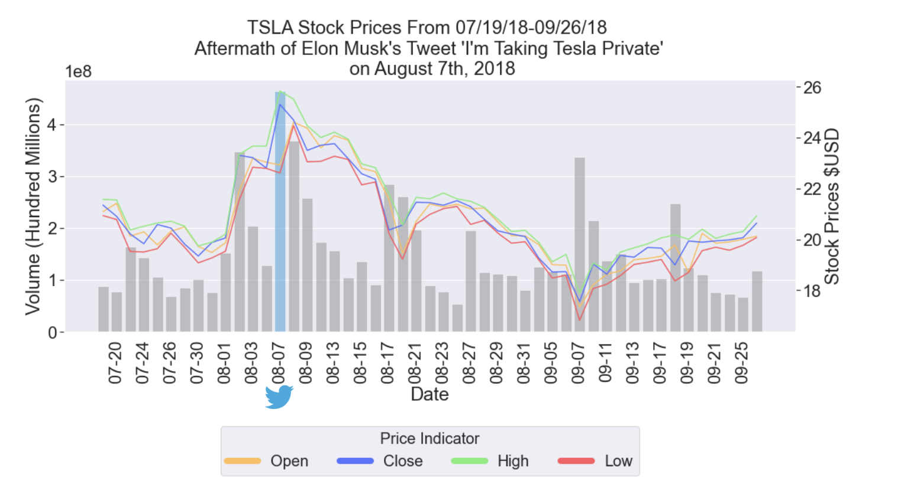

# musk-tweets-TSLA

Investigation and visualization of influence of Elon Musk's controversial Tweets on TSLA Stock. 

## About the Project

Investopedia's article "6 Big Risks of Investing in Tesla Stock" claims that Elon Musk is a "lightning rod for scandal" (Ross), suggesting that Musk's 
persona and behavior contributes to Tesla's risk.
To test this hypothesis, I analyzed the impact of Elon Musk's most controversial Tweets on TSLA stock price and trading volume. 
I analzyed his controversial Tweets related to Tesla, trans rights, and his political views. I found that there was a correlation between extreme high and low values with his controversial Tweets about Tesla. Though [sources](https://babel.ua/en/news/85114-tesla-shares-fall-nearly-9-after-musk-tweets-about-peace-treaty-between-ukraine-and-russia) suggest that Musk's other problematic Tweets have affected stock price, a correlation was not observed. 
## Author

Kaya Lee @klee2024
